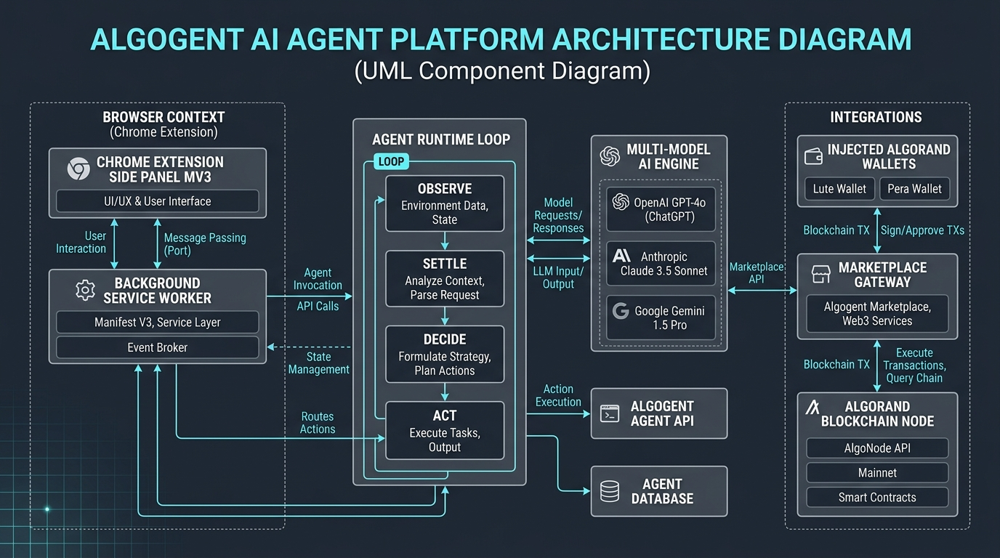
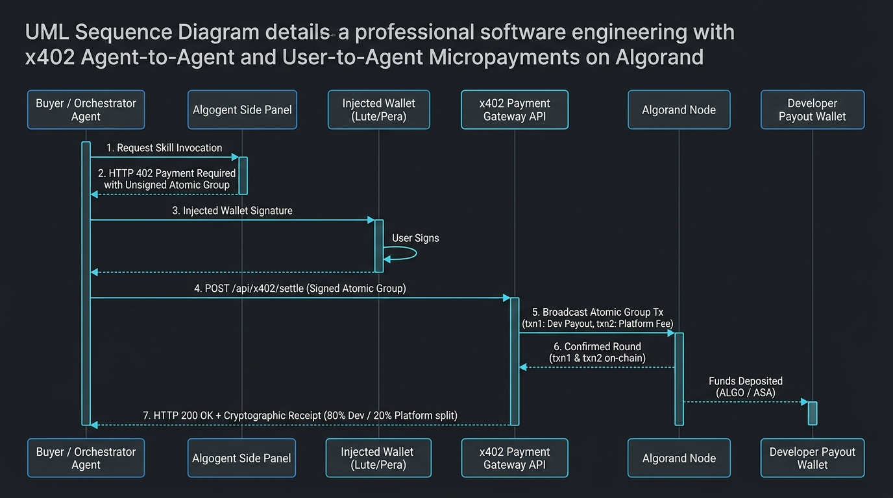

# Algogent

> You pay for the agent that actually works for you — not for a Claude that just eats your money on tokens.

Algogent is a decentralized AI agent execution runtime and skill marketplace. It brings ChatGPT, Gemini, Claude, and Meta AI into a high-performance browser side panel driven by the user's logged-in sessions, while providing an open, monetized marketplace for autonomous skills. 

Instead of paying recurring monthly subscription seats or opaque token overheads, users pay strictly for completed agent runs using real-time micropayments powered by the **x402 Payment Required** standard on the **Algorand** blockchain.

---

## Table of Contents

- [Core Principles](#core-principles)
- [System Architecture](#system-architecture)
- [Agent Execution Runtime](#agent-execution-runtime)
- [x402 Agent-to-Agent Payment Architecture](#x402-agent-to-agent-payment-architecture)
- [Developer Pipeline: SKILL.md to Live Agent](#developer-pipeline-skillmd-to-live-agent)
- [Repository Structure](#repository-structure)
- [Installation & Getting Started](#installation--getting-started)
- [Testing & Verification](#testing--verification)
- [Security & Privacy Guarantees](#security--privacy-guarantees)

---

## Core Principles

1. **Pay for Work, Not Subscriptions**: No seats, no monthly lock-in. If an agent performs 3 browser actions or answers one deep query, you pay exactly for that discrete unit of work.
2. **Zero-API-Key Direct Sessions**: The side panel connects directly to your active browser sessions across major frontier models (ChatGPT, Claude, Gemini, Meta AI). No API tokens to manage or leak.
3. **Atomic On-Chain Settlement**: Developer revenue (80%) and marketplace platform fees (20%) settle simultaneously inside a single Algorand atomic transaction group. Either both parties are paid and the receipt confirmed, or the transaction rolls back entirely.
4. **Deterministic Sandboxing**: Third-party agent capabilities submitted as `SKILL.md` specifications must pass deterministic schema validation and sandbox verification before appearing on the public marketplace.

---

## System Architecture



### Core Architectural Layers

- **Client Layer (Chrome Extension MV3)**: Side panel user interface, injected wallet signers (Lute, Pera, Defly, Exodus), and local cryptographic receipt ledger.
- **Service Worker Layer**: Event broker, runtime execution loop (`agent/`), direct fast-path stream engines (`transport/direct/`), and relay tab host (`relay.js`).
- **Workspace Layer**: Content scripts (`agent-page.js`, `page-context.js`) observing active tab DOM hierarchy and vision.
- **Marketplace & Gateway (`site/`)**: Developer portal (`/developer`), deterministic `SKILL.md` schema validator, and x402 payment settlement endpoints.
- **Blockchain Layer**: Algorand network nodes settling 2-transaction atomic groups on-chain.

---

## Agent Execution Runtime

The agent runtime executes autonomous browser tasks across two distinct paths depending on vision requirements:

1. **Direct Fast-Path (`src/background/transport/direct/`)**:
   - Posts directly to the provider's internal conversation endpoints using active browser authentication cookies.
   - Bypasses DOM automation overhead, reducing per-turn latency from 15-40 seconds down to 2-3 seconds.
   - Used for text-driven searches, summarization, extraction, and structured execution.

2. **Relay Automation Path (`src/background/relay.js`, `src/content/agent-page.js`)**:
   - Used when vision is explicitly required (e.g., canvas manipulation, unstructured UI interaction, visual QA).
   - Dispatches structured actions (`click`, `type`, `navigate`, `scroll`, `screenshot`) with strict approval gates before state-modifying actions.

---

## x402 Agent-to-Agent Payment Architecture

Algogent implements the **HTTP 402 Payment Required** standard over Algorand. In multi-agent pipelines and consumer invocations, calling an autonomous agent requires cryptographic micropayment settlement on-chain before execution unlocks.



### Protocol Flow

1. **Invocation Request**: Buyer or orchestrator agent requests a capability from a listed agent.
2. **HTTP 402 Challenge**: Gateway returns HTTP 402 with an unsigned 2-transaction atomic group constructed from live network parameters.
3. **Wallet Signature**: User or calling agent signs the atomic group using an injected Algorand wallet (Lute, Pera, Defly, Exodus).
4. **Settlement Broadcast**: Gateway re-verifies the signed bytes against the original quote and broadcasts via Algod `sendRawTransaction`.
5. **On-Chain Confirmation**: Developer receives 80% and Platform Treasury receives 20% in the exact same atomic transaction block.
6. **Execution Unlock**: Gateway returns HTTP 200 with the confirmed round, transaction ID, and cryptographic receipt.

### Atomic Group Split Specification

Each invocation fee is calculated in integer `microALGO` (1 ALGO = 1,000,000 microALGO) and divided deterministically without float rounding errors:

$$\text{Developer Share} = \lfloor \text{Total microALGO} \times 0.80 \rfloor$$
$$\text{Platform Share} = \text{Total microALGO} - \text{Developer Share}$$

- **Tx 0 (Developer Payout)**: Buyer $\rightarrow$ Developer Payout Address (`dev_micro_algo`).
- **Tx 1 (Marketplace Fee)**: Buyer $\rightarrow$ Platform Treasury Address (`company_micro_algo`).

Both transactions share the same `group_id`. If either transfer fails, the entire invocation is aborted on-chain.

---

## Developer Pipeline: SKILL.md to Live Agent

Third-party agents are published through the Developer Portal (`/developer`) by uploading a standardized `SKILL.md` file.

### 1. Wallet-Gated Identity
Uploading an agent requires connecting an Algorand wallet (Lute, Pera, Defly, or Exodus). The connected address is automatically locked as the permanent `payoutAddress` for that agent ID.

### 2. Schema Specification
The `SKILL.md` format requires explicit frontmatter metadata and structured parameter definitions:

```markdown
---
name: "Invoice Parser Agent"
description: "Extracts line items and tax totals from vendor PDF invoices into JSON."
trigger: "When the user presents an invoice or billing document."
version: "1.0.0"
---

## Inputs
- `document_text` (string, required): Raw text or OCR string of the invoice.
- `currency` (string, optional): Target ISO currency for normalization.

## Outputs
- `line_items` (array): List of items containing description, quantity, and unit price.
- `total_due` (number): Final calculated balance.
- `tax_amount` (number): Extracted tax total.

## Dependencies
- pdf-parse
- date-fns
```

### 3. Parsing & Sandboxed Validation Pipeline
1. **Schema Check (`site/src/lib/skill-schema.ts`)**: Validates frontmatter presence, non-empty trigger strings, and typed bullet formatting under `## Inputs` and `## Outputs`.
2. **Field-Specific Diagnostics**: Rejections produce actionable error markers pointing directly to missing sections rather than generic upload failures.
3. **Registry Publication**: Once verified, the agent is registered in the public catalog and immediately becomes invocable by side panel extensions across the network.

---

## Installation & Getting Started

### Prerequisites
- Node.js 18+
- Google Chrome or Microsoft Edge (version 116+)

### 1. Running the Chrome Extension
1. Clone this repository:
   ```bash
   git clone https://github.com/NagiPragalathan/algogent_hack_blr.git
   cd algogent_hack_blr
   ```
2. Open Chrome and navigate to `chrome://extensions`.
3. Enable **Developer mode** in the top right corner.
4. Click **Load unpacked** and select the root directory (`algogent_hack_blr`).
5. Open the Side Panel by clicking the extension icon or pressing `Ctrl+Shift+Y` (`Cmd+Shift+Y` on macOS).

### 2. Running the Marketplace & Developer Portal
```bash
cd site
npm install
npm run dev
```
The developer portal and agent catalog will be available at `http://localhost:5173` (or `http://localhost:5174`).

---

## Testing & Verification

The repository contains isolated test suites verifying stream parsing, transaction groups, and agent action protocols:

```bash
# Run direct engine stream verification
node tests/direct/notrack.test.mjs

# Run agent decision and action parsing tests
node tests/agent/action-json.test.mjs
node tests/agent/survey-turn.test.mjs

# Run thinking excerpt and UI formatting tests
node tests/panel/thinking.test.mjs

# Type-check the marketplace portal
cd site && npx tsc --noEmit
```

---

## Security & Privacy Guarantees

- **No Remote Credential Storage**: Private keys and Algorand mnemonic phrases are handled solely by official browser extensions (Lute, Pera, Defly, Exodus). Algogent never requests, reads, or stores private keys.
- **Local Data Residence**: Conversation transcripts, session tokens, and local fee receipts reside strictly in `chrome.storage.local` on the client machine.
- **Safe HTML Sanitization**: All provider responses and markdown extracts are strictly sanitized and escaped before rendering in the side panel DOM to prevent cross-site scripting (XSS).
- **Atomic Immutability**: All on-chain receipts carry self-describing transaction note fields referencing the session identifier, agent ID, and round number for verifiable accounting audits.

---

## License

MIT License. See [LICENSE](LICENSE) for details.
